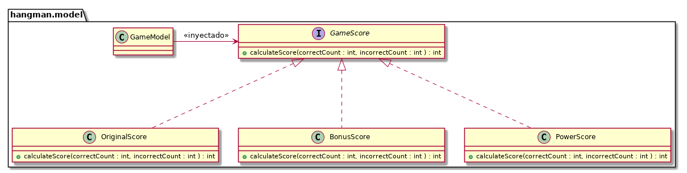

### Escuela Colombiana de Ingeniería
### LAB 4 - CVDS
- Laura Valentina García León.
- Juan David Murillo Giraldo.

### Procesos de Desarrollo de Software

### Desarrollo Dirigido por Pruebas + DIP + DI + Contenedores Livianos

Para este taller se va a trabajar sobre el juego del ahorcado.

El sistema actual de puntuación del juego comienza en 100 puntos y va
descontando 10 puntos cada vez que se propone una letra incorrecta.

Algunos usuarios han propuesto diferentes esquemas para realizar la
puntuación, los cuales se describen a continuación:

* OriginalScore: 
    * Es el esquema actual, se inicia con 100 puntos.
    * No se bonifican las letras correctas.
    * Se penaliza con 10 puntos con cada letra incorrecta.
    * El puntaje minimo es 0.

* BonusScore: 
    * El juego inicia en 0 puntos.
    * Se bonifica con 10 puntos cada letra correcta.
    * Se penaliza con 5 puntos cada letra incorrecta.
    * El puntaje mínimo es 0
    
* PowerBonusScore:
    * El juego inicia en 0 puntos.
    * La $i-ésima$ letra correcta se bonifica con $5^i$.
    * Se penaliza con 8 puntos cada letra incorrecta.
    * El puntaje mínimo es 0
    * Si con las reglas anteriores sobrepasa 500 puntos, el puntaje es
      500.

Lo anterior, se traduce en el siguiente modelo, donde se aplica el
principio de inversión de dependencias:

### Parte I

*  A partir del código existente, implemente sólo los cascarones del
   modelo antes indicado.

*  Haga la especificación de los métodos calculateScore (de las tres
   variantes de GameScore), a partir de las especificaciones
   generales dadas anteriormente. Recuerde tener en cuenta: @pre,
   @pos, @param, @throws.
   
  	* Interface. 
   
   
   
   	* Original Score. 
   
   
   
   	* Bonus Score. 
   
   
   
   	* Powe Bonus Score. 
   
   
   

* Actualice el archivo `pom.xml` e incluya las dependencias para la ultima versión de JUnit y la versión del compilador de Java a la versión 8 .
	
	* Actulización archivo pom. 
	
	
   

* Teniendo en cuenta dichas especificaciones, en la clase donde se
   implementarán las pruebas (GameScoreTest), en los
   comentarios iniciales, especifique las clases de equivalencia para
   las tres variantes de GameScore, e identifique
   condiciones de frontera. 

	* Especificación de los limites para cada clase. 
	
	

* Para cada clase de equivalencia y condición de frontera, implemente
   una prueba utilizando JUnit.

	* Implementación de pruebas. 
	
	
	
	
	
	
	
	
	
	
* Realice la implementación de los 'cascarones' realizados anteriormente.
   Asegúrese que todas las pruebas unitarias creadas en los puntos anteriores
   se ejecutan satisfactoriamente.
   
   	* Ejecución de pruebas 

	

### Parte II

Actualmente se utiliza el patrón FactoryMethod
que desacopla la creación de los objetos para diseñar un juego
de ahorcado (revisar createGUIUsingFactoryMethod en SwingProject, el
constructor de la clase GUI y HangmanFactoryMethod).

En este taller se va a utilizar un contenedor liviano ([GoogleGuice](https://github.com/google/guice)) el cual soporta la inyección de las dependencias.

*  Utilizando el HangmanFactoryMethod (MétodoFabrica) incluya el
   OriginalScore a la configuración.
   
	* Hangman Factory Method 
	
	

Incorpore el Contenedor Liviano Guice dentro del proyecto:

* Revise las dependencias necesarias en el pom.xml.
* 
	* Se añade la dependencia de guice
	
	

* Modifique la inyección de dependencias utilizando guice en lugar del
  método fábrica..
  
  	* Creación del GUI mediiante guice 

	

* Configure la aplicación de manera que desde el programa SwingProject
  NO SE CONSTRUYA el Score directamente, sino a través de Guice, asi
  mismo como las otras dependencias que se están inyectando mediante
  la fabrica.
  
  	* Modificación de HangmanFactoryService 
  	
	
  	
  
* Mediante la configuración de la Inyección de
  Dependencias se pueda cambiar el comportamiento del mismo, por
  ejemplo:
  
	* Utilizar el esquema OriginalScore.
	
	
	
	
	* Utilizar el esquema BonusScore.
	
	
	

	* Utilizar el idioma francés.
	
	
	
	
   	* Utilizar el diccionario francés.
	
	
	

	* Utilizar el idioma Español y el diccionario Español 

	
	

	

